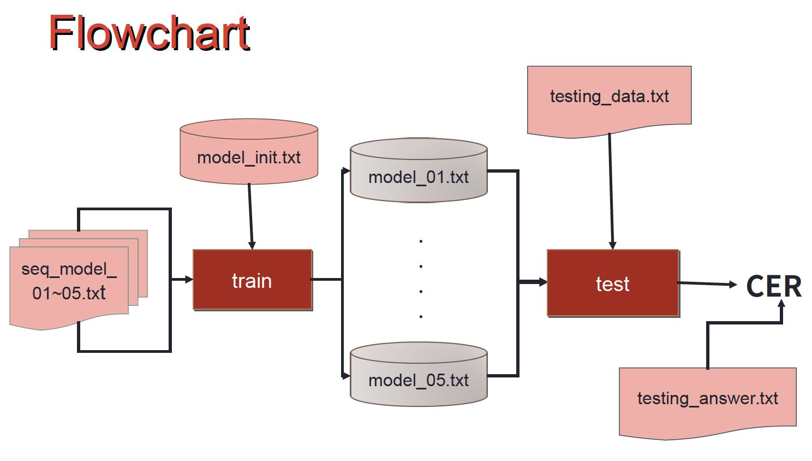

# Dsp_hw
Fundamentals of Speech Signal Processing Programming Homework

國立台灣大學《數位語音處理概論》 课程

李琳山

## hw1 DISCRETE HIDDEN MARKOV MODEL IMPLEMENTATION

已给HMM模型的基本文件（hmm.h），用于读取文件存储的离散HMM模型.

### A. Training

在这部分，使用Forward和Backward算法，对给出的初始HMM进行迭代更新。
 
> *forbackward.h*
> 
>  **ForBackwardBlock** 为定义的临时存储数据结构（C中为结构体）, **Alpha, Beta, Gamma, Epsilon** 分别为算法对应的中间变量矩阵。最后利用这些矩阵变量来计算更新HMM的initial，transition和observation矩阵。

### B. Testing

在这里使用Viterbi Algorithm计算最大可能路径上每个模型的概率，最大的作为预测结果。

> *viterbi.h*
>
> **ViterbiBlock**为定义的临时存储数据结构，**Delta**和**Psi**为相应变量矩阵。